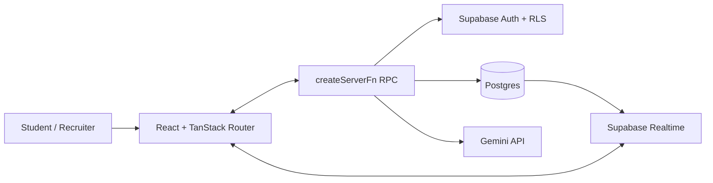

# AI Placement Companion 🚀

A production-grade, AI-driven SaaS designed to help students get placement-ready. The application features automated resume analysis, interactive mock interviews, curated DSA roadmaps, adaptive study planners, public portfolios, recruiter search, community discussion boards, and gamification—all wired to a Supabase Postgres backend and Google Gemini.


---

## 🌟 Key Features

- **📄 AI Resume Analyzer** — Calculates ATS score, identifies missing keywords/skills, checks role-match percentage, and suggests actionable bullet-point rewrites.
- **🎙️ AI Mock Interviews** — Generates role-specific question sets and evaluates student responses with feedback across technical, communication, confidence, and problem-solving skills.
- **🛣️ LeetCode Roadmap** — Curated topic-tagged DSA problem sets with status tracking, progress bars, and personal solution notes.
- **📅 Adaptive Study Planner** — Generates customized 7-day preparation plans based on detected resume gaps and historical DSA progress.
- **💼 Smart Jobs Portal** — Recommends matching roles with compatibility percentages calculated using candidate profile details.
- **👥 Community Forum** — Features discussion channels, real-time posts, likes, and nested comments using Supabase Realtime.
- **📊 Analytics Dashboard** — Visualizes ATS scores over time, DSA progress, mock interview performance, and key readiness metrics via interactive charts (Recharts).
- **🏆 Gamification & Engagement** — Features customizable achievements, streak tracking, and a global leaderboard.
- **🌐 Public Portfolios** — Opt-in public candidate portfolios accessible at `/u/:username` featuring customizable share-cards.
- **🔎 Recruiter Search Engine** — Allows recruiters to filter candidates by skills, ATS range, and interview scores, and save matches to custom candidate shortlists.

---

## 🛠️ Tech Stack

- **Frontend** — React 19 · TypeScript · TanStack Start (Beta/v1) · TanStack Router · TanStack Query · Tailwind CSS v4 · shadcn/ui · Lucide Icons · Recharts
- **Backend** — Supabase · Postgres + Row-Level Security (RLS) · Realtime WebSockets · Supabase Storage
- **AI Engine** — Google Gemini API (via Vercel AI SDK)
- **Bundling & Server** — Vite 8 · Vinxi · Nitro (Node.js/Vercel SSR Engine)

---

## 🏗️ Architecture



For technical deep-dives, see:
* [`architecture.md`](file:///c:/Users/vansh/OneDrive/Desktop/Projectsss/AI%20Placement%20Companion/architecture.md)
* [`database-design.md`](file:///c:/Users/vansh/OneDrive/Desktop/Projectsss/AI%20Placement%20Companion/database-design.md)
* [`api-documentation.md`](file:///c:/Users/vansh/OneDrive/Desktop/Projectsss/AI%20Placement%20Companion/api-documentation.md)

---

## ⚙️ Local Setup

Follow these steps to run the project locally on your machine:

1. **Install Dependencies:**
   Make sure you have [Node.js](https://nodejs.org/) installed. We recommend using `npm` or `bun` for execution:
   ```bash
   npm install
   # OR using bun
   bun install
   ```

2. **Configure Environment Variables:**
   Copy the example environment file and fill in the required keys:
   ```bash
   cp .env.example .env
   ```
   Open `.env` and configure the following variables:
   ```env
   # Browser-visible environment variables (safe for client)
   VITE_SUPABASE_URL=https://your-project.supabase.co
   VITE_SUPABASE_PUBLISHABLE_KEY=your-supabase-anon-key
   VITE_SUPABASE_PROJECT_ID=your-project-id

   # Server-side environment variables (never exposed to client)
   SUPABASE_URL=https://your-project.supabase.co
   SUPABASE_PUBLISHABLE_KEY=your-supabase-anon-key
   SUPABASE_SERVICE_ROLE_KEY=your-supabase-service-key
   GEMINI_API_KEY=your-gemini-api-key
   # Note: LOVABLE_API_KEY can be used as a fallback for GEMINI_API_KEY
   ```

3. **Run Development Server:**
   ```bash
   npm run dev
   # OR using bun
   bun run dev
   ```
   Open `http://localhost:3000` (or the port shown in your terminal) in your browser.

---

## 🛠️ Build and Lint Scripts

You can use the following scripts to maintain code quality and build for production:

| Command | Bun Alternative | Purpose |
| :--- | :--- | :--- |
| `npm run dev` | `bun run dev` | Starts the Vite/TanStack development server |
| `npm run build` | `bun run build` | Compiles and builds the production bundle |
| `npm run lint` | `bun run lint` | Runs ESLint checker across the codebase |
| `npm run format` | `bun run format` | Formats all files using Prettier |

---

## 🚀 Deployment to Vercel & GitHub Push

Here is the recommended workflow to push the project to GitHub and deploy it to Vercel:

### 1. Push Code to GitHub

1. **Initialize Git (if not already done):**
   ```bash
   git init
   ```
2. **Add Files to Staging:**
   ```bash
   git add .
   ```
3. **Commit the Changes:**
   ```bash
   git commit -m "chore: migrate server fns to new validator api and update documentation"
   ```
4. **Create a Remote Repository on GitHub:**
   Go to [GitHub](https://github.com/new) and create a repository (e.g. `ai-placement-companion`).
5. **Link and Push to GitHub:**
   ```bash
   git branch -M main
   git remote add origin https://github.com/YOUR_USERNAME/YOUR_REPOSITORY.git
   git push -u origin main
   ```

---

### 2. Deploy to Vercel

Vercel natively supports Vite, Nitro, and TanStack Start projects out of the box with zero configuration:

1. **Log in to Vercel:**
   Go to [Vercel Dashboard](https://vercel.com).
2. **Import your GitHub Repository:**
   - Click **Add New > Project**.
   - Select your imported GitHub repository.
3. **Configure Project Settings:**
   - Vercel automatically detects the framework and sets:
     - **Build Command:** `npm run build` or `bun run build`
     - **Output Directory:** Automatic (Nitro output `.vercel/output`)
4. **Configure Environment Variables:**
   Add all keys from your local `.env` file under the **Environment Variables** section:
   * `VITE_SUPABASE_URL`
   * `VITE_SUPABASE_PUBLISHABLE_KEY`
   * `VITE_SUPABASE_PROJECT_ID`
   * `SUPABASE_URL`
   * `SUPABASE_PUBLISHABLE_KEY`
   * `SUPABASE_SERVICE_ROLE_KEY`
   * `GEMINI_API_KEY` (or `LOVABLE_API_KEY`)
5. **Click Deploy:**
   Once finished, Vercel will build the server-side functions and client bundle, providing you with a live URL!

---

## 👥 Demo Credentials

The platform has demo accounts initialized for evaluation:
* **Student Dashboard:** `demo_student@placement.ai` / `DemoStudent123!`
* **Recruiter Dashboard:** `demo_recruiter@placement.ai` / `DemoRecruiter123!`

---

## 🗂️ Folder Structure

```
src/
├── routes/                  # File-based routing (TanStack Router)
│   ├── _authenticated/      # Protected route subtree (SSR disabled)
│   ├── u.$username.tsx      # Public portfolio route
│   └── index.tsx            # Landing/Marketing page
├── components/              # Reusable UI components & shadcn primitives
├── lib/                     # Server functions & shared utility fns
│   ├── *.functions.ts       # createServerFn API RPC end-points
│   ├── *.server.ts          # Node-only helper functions
│   └── readiness.ts         # Scoring & placement calculations
├── integrations/supabase/   # Auto-generated Types & client client
├── data/                    # Curated LeetCode lists & static resources
└── styles.css               # Design system classes, tokens, & root theme
```

## 📄 License

This project is licensed under the MIT License.
