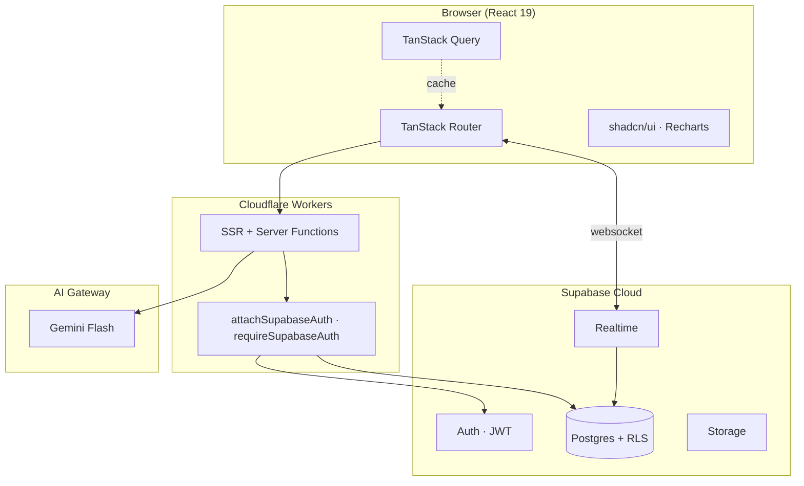

# Architecture

## High-level

AI Placement Companion is a server-rendered React app on **TanStack Start v1** deployed to **Cloudflare Workers**. All app-internal server logic uses **typed RPC** (`createServerFn`). Data lives in **Postgres** behind **Supabase** with row-level security. AI calls go through a dedicated **AI Provider** (Gemini).



## Layers

### 1. Routing & Rendering

- **File-based routes** under `src/routes/`.
- Protected subtree under `_authenticated/` is `ssr: false` (Supabase session lives in `localStorage`); the route gate redirects to `/auth` on the client.
- Public routes (`index`, `u/$username`) ship full SSR HTML for share-card OG tags.

### 2. Data layer

- **TanStack Query** is the default read mechanism. Loaders call `ensureQueryData`; components call `useSuspenseQuery`.
- All mutations and reads cross the network as `createServerFn` calls — never raw `fetch` from components.

### 3. Server functions

- Live in `src/lib/*.functions.ts`. Each one:
  - validates input with **Zod**,
  - attaches `requireSupabaseAuth` middleware when user-scoped,
  - returns plain DTOs (no class instances).
- Privileged work (auth admin, recruiter checks) imports `client.server.ts` **inside the handler** only — never at module scope.

- `createLovableAiGatewayProvider(LOVABLE_API_KEY)` builds the AI provider.
- Default model: `google/gemini-3-flash-preview` / `google/gemini-2.5-flash`.
- Structured outputs use `generateObject` + Zod schemas (resume analysis, interview feedback, planner, jobs).
- Errors surface 429 (rate limit) and 402 (credits) distinctly.

### 5. Security

- RLS on every public-schema table; all user-scoped policies key off `auth.uid()`.
- Roles in a separate `user_roles` table; checked via `has_role(uuid, app_role)` security-definer fn.
- `SUPABASE_SERVICE_ROLE_KEY` is never imported into route or component code.

### 6. Realtime

- `community_posts`, `comments`, `post_likes` publish via Supabase Realtime. Client subscribes in `useEffect` and tears down on unmount.

### 7. Placement Readiness Score

A single weighted metric computed by `src/lib/readiness.ts`:

```
score = 0.30 × interview
      + 0.30 × coding
      + 0.25 × resume
      + 0.15 × plan
      + consistency_bonus (≤ 5)
```

Hiring probability uses a soft S-curve (`logistic((score - 55)/10)`), capped at 92%. Used identically by the student dashboard and the recruiter candidate card.

## Module Boundaries

| Module                         | Owns                                            |
| ------------------------------ | ----------------------------------------------- |
| `src/lib/ai-gateway.server.ts` | Provider helper, header propagation             |
| `src/lib/*.functions.ts`       | RPC surface; client-imports allowed             |
| `src/lib/*.server.ts`          | Server-only helpers; never imported from routes |
| `src/integrations/supabase/*`  | Auto-generated clients + middleware             |
| `src/components/*`             | Presentational; no server imports               |
| `src/data/*`                   | Static datasets (LeetCode roadmap)              |

## Failure Modes

- AI 429/402 → typed error message surfaced via `toUserMessage`.
- Supabase RLS deny → caught in server fn, mapped to user-facing copy.
- Network/route load error → `errorComponent` on every route + root `defaultErrorComponent`.
- Missing public profile → `notFound()` thrown from public server fn.

## Performance

- Route-level code splitting via TanStack Router file-based routes.
- `defaultPreloadStaleTime: 0` keeps loader data fresh on hover-preload.
- AI calls capped (input truncated to 18k chars for resume analysis).
- Recharts charts are memoized; analytics aggregates server-side in a single round trip.

## Deployment

- `bun run build` produces a Cloudflare Worker bundle.
- Lovable Cloud injects env vars (`SUPABASE_*`, `LOVABLE_API_KEY`).
- Migrations run via Lovable's migration tool — each migration is a single approved transaction.
