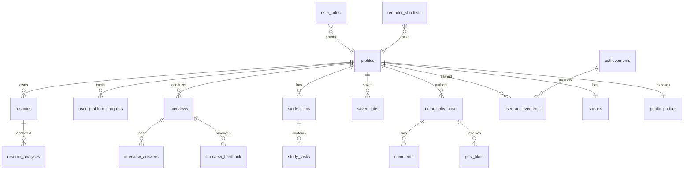

# Database Design

All tables live in the `public` schema. Every table has RLS enabled and explicit grants. User-scoped tables key off `auth.uid()`; lookup/catalog tables are readable by `authenticated` (or `anon` where explicitly public).

## Entity Map



## Tables

### Identity

- **profiles** — mirrors `auth.users`; full name, college, branch, skills, social links.
- **user_roles** — `(user_id, role)` with `app_role` enum (`student`, `admin`, `recruiter`). Checked via `has_role(uuid, app_role)`.

### Resume

- **resumes** — uploaded file metadata + extracted text.
- **resume_analyses** — Gemini-produced JSON: ATS score, strengths, weaknesses, missing keywords/skills, role-match %, suggestions, recommended topics.

### DSA Roadmap

- **user_problem_progress** — `(user_id, problem_slug)` unique; status, revision_count, notes, solved_at.

### Interview Simulator

- **interviews** — session header (role, type, status, aggregated scores).
- **interview_answers** — per-question answer text.
- **interview_feedback** — per-question AI feedback + scores.

### Study Planner

- **study_plans** — 7-day plan generated from resume gaps + DSA performance.
- **study_tasks** — atomic tasks with status, day index, estimated minutes.

### Jobs

- **saved_jobs** — AI-matched roles with match_percent and tags.

### Community (Realtime)

- **community_posts** — text + room (general / interview / dsa / projects / placement).
- **comments**, **post_likes**, **saved_posts** — engagement.

### Gamification

- **achievements** — catalog, seeded by migration.
- **user_achievements** — earned badges.
- **streaks** — current / best / total activity days, last_activity_date.

### Public Portfolio

- **public_profiles** — opt-in slug at `/u/:username`; per-section visibility flags.

### Recruiter

- **recruiter_shortlists** — `(recruiter_id, candidate_id)` with notes.

## Security model

- All user-data policies use `auth.uid() = user_id` for `USING` and `WITH CHECK`.
- `public_profiles` has a `TO anon` SELECT policy gated by `is_public = true` for share links.
- `community_posts` etc. are `TO authenticated` only.
- `recruiter_shortlists` policies require `public.has_role(auth.uid(), 'recruiter')`.

## Triggers

- `handle_new_user` (on `auth.users` insert) → creates a `profiles` row.
- `bump_post_like_count`, `bump_post_comment_count` — denormalized counters on `community_posts`.
- `tg_set_updated_at` — generic touch trigger on rows with `updated_at`.

## Grants Pattern

Every new public-schema table follows:

```sql
CREATE TABLE public.<name> (...);
GRANT SELECT, INSERT, UPDATE, DELETE ON public.<name> TO authenticated;
GRANT ALL ON public.<name> TO service_role;
-- GRANT SELECT ON public.<name> TO anon;  -- only for public-readable tables
ALTER TABLE public.<name> ENABLE ROW LEVEL SECURITY;
CREATE POLICY ... ;
```
